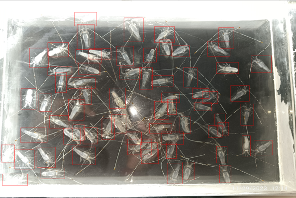

# Automated Lobster Seed Detection and Localization using YOLOv8s

This repository hosts a deep learning project aimed at automating the detection and localization of lobster seeds in images. Manual counting of lobster seeds in images can be time-consuming and prone to human error. This project utilizes YOLOv8s, a state-of-the-art object detection algorithm, to automate this process, thereby reducing manual effort and minimizing the potential for human error.

The dataset used in this project consists of 266 labeled images of collected lobster seed images. By leveraging advanced preprocessing techniques and augmentations, the dataset is enhanced to improve model generalization and robustness.

## Dataset Preprocessing

### Applied Transformations:
- **Auto-Orient**: Ensures consistent orientation across images.
- **Resize**: Standardizes images to a resolution of 640x640.
- **Auto-Adjust Contrast**: Enhances image contrast using Adaptive Equalization.

### Augmentations:
- **Flip**: Horizontal and vertical flips.
- **Crop**: Zoom ranging from 0% to 25%.
- **Shear**: ±15° horizontally and vertically.
- **Brightness**: Adjustment between -25% and +25%.
- **Bounding Box Transformations**: Applied flips, rotations (±15°), and shears (±15°) to bounding boxes.

## Dataset Split
The preprocessed dataset is split into three sets:

| Dataset Type  | Number of Images |
| --------------| -----------------|
| Training Set  | 558              |
| Validation Set| 53               |
| Test Set      | 27               |

## Model Performance
After training, the model demonstrates high accuracy in lobster seed detection and localization:

| Metric     | Value |
| -----------|-------|
| mAP        | 96.7% |
| Precision  | 97.3% |
| Recall     | 96.7% |

You can access the model detailed information [here](https://universe.roboflow.com/diki-bagastama-5ondf/lobster-seed-detection).

## Example Result
Here is an example result image:

## Functional Prototype
A functional prototype has been developed using Streamlit, enabling users to:
- Upload images for lobster seed detection and localization.
- Utilize their camera to detect and localize lobster seeds in real-time.

You can access the Streamlit prototype [here](https://lobster-seed-detection.streamlit.app/).

## Usage
1. Clone this repository.
2. Install the necessary dependencies.
3. Run the Streamlit application using `streamlit run app.py`.
4. Upload images or use your camera to test the lobster seed detection and localization model.

## Dependencies
- Python
- Roboflow
- Pillow
- Numpy
- Streamlit

## References
- [YOLOv8](https://yolov8.com/)
- [Streamlit](https://streamlit.io/)

For more details, please refer to the documentation and comments within the code. Contributions and feedback are welcome!
